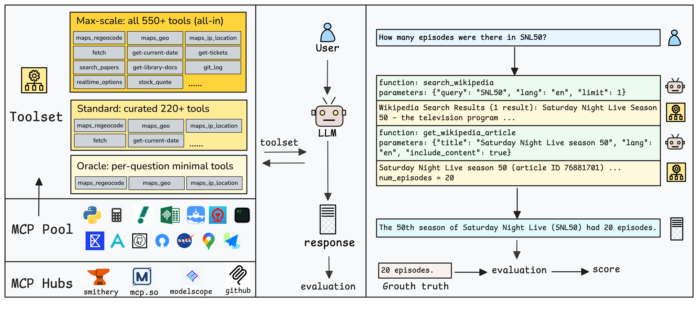

# MCPVerse: An Expansive, Real-World Benchmark for Agentic Tool Use 

[](https://www.python.org)

[](https://arxiv.org/abs/2508.16260)


## Overview

MCPVerse is a comprehensive benchmark built on a large-scale set of executable, real-world tools. With three evaluation modes, it tests LLMs from using a minimal, per-question toolset to mounting 550+ tools at once—approaching an OS-like environment. MCPVerse thus provides a realistic, execution-grounded benchmark of current LLM agentic capabilities.

The evaluation system is build on top of [CAMEL](https://github.com/camel-ai/camel), thanks to their excellent work.

## Leadboard
| Model            | Context Limit  | Native Tool Limit | Oracle Avg. |     L1    |     L2    |     L3    | Standard Avg. |     L1    |     L2    |     L3    | Max-Scale Avg. |     L1    |     L2    |     L3    |
| ---------------- | :-----: | :---: | :---------: | :-------: | :-------: | :-------: | :-----------: | :-------: | :-------: | :-------: | :------------: | :-------: | :-------: | :-------: |
| DeepSeek-V3-0324 |   64k   |   –   |    49.55    |   66.66   |   46.51   |   35.48   |     37.58     |   58.33   |   30.23   |   24.19   |        –       |     –     |     –     |     –     |
| DeepSeek-R1-0528 |   64k   |   –   |    50.77    |   61.67   |   51.94   |   38.71   |     50.28     |   58.33   |   45.74   |   46.77   |        –       |     –     |     –     |     –     |
| Claude-4-Sonnet  |   200k  |   –   |  **57.81**  |   68.33   |   53.49   | **51.61** |   **61.01**   | **70.00** | **56.59** | **56.45** |    **57.77**   | **66.66** | **55.04** | **51.61** |
| Qwen3-235B-A22B  |   128k  |   –   |    47.90    |   63.33   |   46.51   |   33.87   |     42.26     |   58.33   |   42.64   |   25.81   |        –       |     –     |     –     |     –     |
| GPT-4o-20241120  |   128k  |  128  |    51.32    | **72.41** |   46.46   |   35.09   |    26.83\*    |  53.33\*  |  15.50\*  |  11.67\*  |        –       |     –     |     –     |     –     |
| Qwen3-30B-A3B    |   128k  |   –   |    33.31    |   53.33   |   24.03   |   22.58   |     22.78     |   36.66   |   13.95   |   17.74   |        –       |     –     |     –     |     –     |
| Gemini-2.5-Pro   |    1M   |  512  |    48.25    |   65.00   |   42.64   |   37.10   |     47.33     |   61.67   |   48.06   |   32.26   |     42.28\*    |  60.00\*  |  42.64\*  |  24.19\*  |
| Kimi-K2-0711     |   128k  |  128  |    55.84    |   63.33   | **55.81** |   48.39   |    16.34\*    |  25.00\*  |  24.03\*  |   0.00\*  |        –       |     –     |     –     |     –     |

*Notes:* Context = max context length; Tools = native tool limit. Dashes (–) mean not evaluated for that mode. Scores with `*` used prompt-based function calling instead of native tools due to context limits. Bold numbers are column bests.


## Installation
1. Clone the repository
```bash
git clone https://github.com/hailsham/mcpverse
cd mcpverse
```

2. using uv to install the dependencies
```bash
pip install uv
uv venv .venv --python=3.10
source .venv/bin/activate

uv pip install -e ".[all, dev]"
```

## Quick Start

### Setup API Keys

#### MCP Service API Keys (Required)
In the entire MCP Pool are under `mcpverse/tool_full.json`, some MCP services also require API Key registration. Below are the links to these APIs.
- [Amap-maps](https://lbs.amap.com/api/webservice/create-project-and-key)
- [alphavantage](https://www.alphavantage.co/)
- [rijksmuseum-server](https://data.rijksmuseum.nl/docs/api/)
- [nasa-mcp](https://api.nasa.gov/)
- [varflight](https://dataworks.variflight.com/blog/smarter-travel-with-ai--introducing-variflight-s-aviation-mcp-server)

After get your API keys, edit `.env` to include your API keys.
```bash
SMITHERY_API_KEY = "YOUR_API_KEY"
AMAP_API_KEY = "YOUR_API_KEY"
ALPHAVANTAGE_API_KEY = "YOUR_API_KEY"
RIJKSMUSEUM_API_KEY = "YOUR_API_KEY"
NASA_API_KEY = "YOUR_API_KEY"
VARFLIGHT_API_KEY = "YOUR_API_KEY"
```


#### LLM API Keys
To provide your API keys,  edit `.env` to include your LLM API keys.
```bash
QWEN_API_BASE_URL="YOUR_API_KEY"
QWEN_API_KEY="YOUR_API_KEY"
ANTHROPIC_API_BASE_URL="YOUR_API_KEY"
ANTHROPIC_API_KEY="YOUR_API_KEY"
```


### Run Evaluation

#### Debug Mode
To run a test evaluation on a debug mode, run
```bash
cd mcpverse
# Q: How many files in {MCPVerse_ROOT}/test_data/txt ? 
# Mounted MCP list:  ["filesystem", "fetch", "time"]
python runner.py --mode debug --model_name deepseek-v3
```

#### Running Benchmark
1. prepare test_data
    ```bash
    cd test_data
    chmod +x generate_repo.sh
    ./generate_repo.sh
    ```


2. Get reference for time-sensetive tasks
    ```bash
    python runner.py --mode get_ref --inout_path results/input_with_ref.csv
    ```

3. inference
    run **oracle** mode using FC
    ```bash
    python runner.py --mode infer --infer_mode oracle --fc_mode FC --model_name deepseek-v3 --inout_path results/input_with_ref.csv
    ```


    run **stanrdard** mode using FC
    ```bash
    python runner.py --mode infer --infer_mode standard --fc_mode FC --model_name deepseek-v3 --inout_path results/input_with_ref.csv
    ```

    run **standard** mode using Prompt
    ```bash
    python runner.py --mode infer --infer_mode standard --fc_mode Prompt --model_name deepseek-v3 --inout_path results/input_with_ref.csv
    ```


4. evaluate
    setup judge model at `judger.py` and run
    ```bash
    python runner.py --mode eval --model_name deepseek-v3 --inout_path results/input_with_ref.csv --judege_model GPT4o
    ```

5. calculate score
    ```bash
    python stats.py -i results/gpt5_input_with_ref_oracle.csv
    ```


Tips:
1. Both inference and evaluation stages can **automatically resume** from inout file.
2. The chat history during inference will be saved in the `logs` folder.
3. The model's intermediate output files will be saved in the `outputs` folder.


### Add New Model
add new model in `MCPAgentRunner::_init_model()` under `mcpverse/mcp_agent_runner.py` 
```python
self.model = ModelFactory.create(
    model_platform=ModelPlatformType.OPENAI_COMPATIBLE_MODEL,
    model_type='Model_Name',
    url="Model_Endpoint"
    api_key='Your_Key'
)
```


### Change Score Model
The default score model is `GPT-4o-20241120`, you can change it by editing `mcpverse/judger.py`


## Citation
If you find this work useful, please cite our paper:
```bibtex
@misc{lei2025mcpverse,
    title={MCPVerse: An Expansive, Real-World Benchmark for Agentic Tool Use}, 
    author={Fei Lei and Yibo Yang and Wenxiu Sun and Dahua Lin},
    year={2025},
    eprint={2508.16260},
    archivePrefix={arXiv},
    primaryClass={cs.AI},
    url={https://arxiv.org/abs/2508.16260}, 
}
```